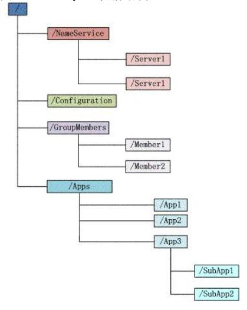

# 1 前言
参考文章：

（科普向）ZooKeeper是如何保证数据一致性的    https://blog.csdn.net/qq_41936805/article/details/98069515

（原理向）ZooKeeper基本原理   https://www.cnblogs.com/luxiaoxun/p/4887452.html

安装和配置   https://www.jianshu.com/p/de90172ea680

（实现向）https://blog.csdn.net/qq_32717909/article/details/94836873     https://blog.csdn.net/qq_32717909/article/details/94836873

目前，分布式系统都是采用一主多从的方式进行部署，在分布式系统的多台服务器要对数据状态达成一致，其实是一件很有难度的事情，因为服务器集群的硬件的问题随时会发生，所以对数据的记录保持一致，是需要一定技巧的。

比如说，我们有两个应用程序都需要对一个相同的文件路径/相同的字段进行读写，但是，如果这两个应用程序对于哪台是namenode的判断不同，就会连接到不同的namenode上，两份文件/数据同时做了不同的修改，同一个数据产生了不同的分支，出现数据冲突，最终，同一个文件名/数据名 指向了两份不同的数据。

**为了保证多台服务器之间数据/文件的一致性**，就有了Zookeeper。

ZooKeeper是一个开放源码的分布式应用程序协调服务，它包含一个简单的原语集，**分布式应用程序可以基于它实现同步服务，配置维护和命名服务等。**

zookeeper也是采用的一主多从的方式进行部署，但是！每个zookeeper节点在都是等价的，增删改查等操作会平等的发给每个节点，不像mysql的主从模式（可能有多种，但是本人目前只了知道一种）。MySQL的主从模式，主库负责DML，从库负责DQL，然后通过binlog实现主从的数据同步。MySQL的主从分别相应客户端不同的动作，而通zookeeper的主从节点都相应客户端的所有操作。

zookeeper的运行结构图如下：

# 2 设计目的（特性）
1. 最终一致性:

client不论连接到哪个server，展示给client的都是同一个视图，这是zookeeper最重要的的特性

2. 可靠性：

具有的简单、健壮、良好的性能，如果client发出的请求被一台服务器接收到，那么它将被所有的服务器接收到

3. 实时性：

zookeeper能保证client能获取最近的一段时间范围内的最新的数据 或则 服务器直接不可用的消息（所以，client查询数据时，要么能获取到可接受的范围内的最新数据，要么是服务器炸了直接获取不到消息）。但是，由于网络延迟等因素，不同client的watcher收到同一数据变化的消息可能会有时差。**如果client就想最新的数据，应该在查询前先调用sync()接口。**

4. 等待无关：

慢的或者失效的client（其实 client的session）不能干预快速的client的请求，这样使得每个client的session都能有效等待。

5. 顺序性：

包括全局有序和偏序两种：全局有序是指如果在一台服务器上消息a在消息b前发布，则在所有Server上消息a都将在消息b前被发布；偏序是指如果一个消息b在消息a后被同一个client发布，a必将排在b前面。

6. 原子性：

数据更新只能成功或者失败，没有中间状态

# 3 zookeeper数据模型
Zookeeper会维护一个具有层次关系的数据结构，它非常类似于一个标准的文件系统，如图所示：

# 4 ZooKeeper Session

# 5 ZooKeeper Watch

# 6 Consistency Guarantees(一致性能保证)

# 7 ZooKeeper的工作原理

# 8 Leader Slection

# 9 Leader工作流程

# 10 Follower工作流程

# 11 Zab: Broadcasting State Updates

# 12 安装和配置
