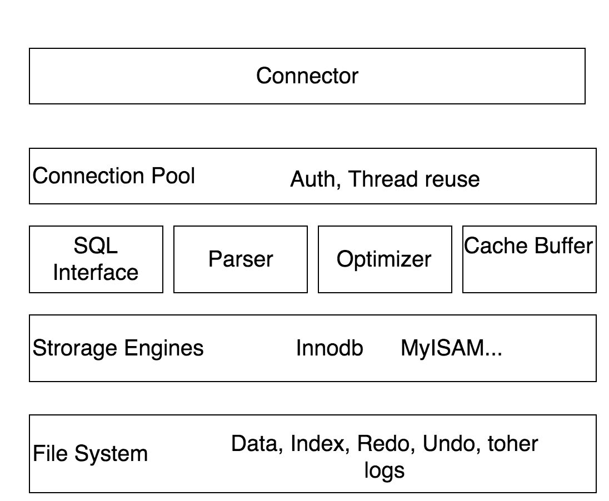

# 1 前言
参考文章：
MVCC实现原理    https://www.jianshu.com/p/f692d4f8a53e

以具体CRUD事务程为例，分析MVCC原理    https://blog.csdn.net/whoamiyang/article/details/51901888

MVCC(Multi Version Concurrency Control的简称)，代表多版本并发控制。与MVCC相对的，是基于锁的并发控制，Lock-Based Concurrency Control)。

**MVCC最大的优势：读不加锁，读写不冲突。在读多写少的OLTP应用中，读写不冲突是非常重要的，极大的增加了系统的并发性能。**

了解MVCC前，我们先学习下Mysql架构和数据库事务隔离级别

# 2 mysql架构


MySQL从概念上可以分为五层:
* 顶层是**接入层**，不同语言的客户端通过mysql的协议与mysql服务器进行连接通信，并且，接入层还进行权限验证、连接池管理、线程管理等。
* 下面是mysql**服务层**，包括sql解析器、sql优化器、数据缓冲、缓存等。
* 再下面是mysql中的存**储引擎层**，mysql中存储引擎是基于表的。
* 最后是**系统文件层**，保存数据、索引、日志等。

# 3 事务隔离级别
大家都知道数据库事务具备ACID特性，即Atomicity(原子性) Consistency(一致性), Isolation(隔离性), Durability(持久性)

原子性：要执行的事务是一个独立的操作单元，要么全部执行，要么全部不执行

一致性：事务的一致性是指事务的执行不能破坏数据库的一致性，一致性也称为完整性。一个事务在执行后，数据库必须从一个一致性状态转变为另一个一致性状态。

隔离性：多个事务并发执行时，一个事务的执行不应影响其他事务的执行，SQL92规范中对隔离性定义了不同的隔离级别：读未提交(READ UNCOMMITED)->读已提交(READ COMMITTED)->可重复读(REPEATABLE READ)->序列化(SERIALIZABLE)。隔离级别依次增强，但是导致的问题是并发能力的减弱。


| 设置                         | 描述                                                         | 脏读   | 不可重复读 | 幻读   |
| ---------------------------- | ------------------------------------------------------------ | ------ | ---------- | ------ |
| TRANSACTION_SERIALIZABLE     | 在一个事务中进行查询时，不允许其他事务对这个查询表的数据修改。 | 不允许 | 不允许     | 不允许 |
| TRANSACTION_REPEATABLE_READ  | 当前事务读取时，不读取其他事务update后的数据，不锁表；但是**可以读取新增的数据**。 | 不允许 | 不允许     | 允许   |
| TRANSACTION_READ_COMMITTED   | 当前事务只读取其他事务提交的数据；当前事务update操作时不锁表。 | 不允许 | 允许       | 允许   |
| TRANSACTION_READ_UNCOMMITTED | 能够读其他事务未提交的数据                                   | 允许   | 允许       | 允许   |

这里再说一下不可重复读和幻读的区别：

不可重复读是，读同一条数据（以主键来区分是否为同一条数据），前后读取的某些字段的值是不同的；幻读是，前后表中的数据条目，会都出来或者减少几条数据，也就是会多几个或者少几个主键。为了避免不可重复读，就要锁住自己正在读取的那几行，不让别人修改自己正在读取的条目，使用TRANSACTION_REPEATABLE_READ隔离级别。为了避免幻读，将表锁住，避免别人向表中增加、减少条目，影响统计。**但是，直接用悲观锁来避免这种情况会严重影响数据库的并发性能**

大多数数据库系统的默认隔离级别都是READ COMMITTED（但MySQL不是)，InnoDB存储引擎默认隔离级别REPEATABLE READ，但是，innoDB能通过多版本并发控制（MVCC，Multiversion Concurrency Control）在可重复读的隔离级别下，使用加锁行锁/间隙锁的select就能解决幻读的问题。

# 4 事务日志
## 4.1 什么是事务日志
事务要保证ACID的完整性**必须依靠事务日志做跟踪**,每一个操作在真正写入数据数据库之前,先写入到日志文件中。比如，如要删除一行数据会先在日志文件中将此行标记为删除,但是数据库中的数据文件并没有发生变化。

只有在(包含多个sql语句)整个事务提交（commit）之后,才把整个事务中的sql语句批量同步到磁盘上的数据库文件，在事务引擎上的每一次写操作都需要执行两遍:

1、先写入日志文件中

写入日志文件中的仅仅是操作过程,而不是操作数据本身,所以速度比写数据库文件速度要快很多

2、再根据事务日志慢慢修改磁盘中的数据本身

写入数据库文件的操作是重做事务日志中已提交的事务操作的记录

以innodb存储引擎为例，事务日志包含：重做日志(redo log)和回滚日志(undo log)，和二进制日志(binlog)是完全不同的，binlog是存储引擎innodb的上一层的产物，binlog必定产生在事务日志之前。

undo log不是redo log的逆向过程，其实它们都算是用来恢复数据库的日志：

1、 redo log通常是物理日志，记录的是数据页的物理修改，而不是某一行或某几行修改成怎样怎样，它用来恢复提交后的物理数据页(恢复数据页，且只能恢复到最后一次提交的位置)。

2、undo log用来回滚行记录到某个版本。undo log一般是逻辑日志，和redo log的DML语句对应。

## 4.2 事务日志作用

事务日志可以帮助提高事务的效率。

使用事务日志，存储引擎在修改表的数据时只需要修改其内存拷贝，再**把该修改行为记录到持久在硬盘上的事务日志中**，而不用每次都将修改的数据本身持久到磁盘，避免了实时持久数据本身的随机IO。

事务日志采用的是追加的方式，因此写日志的操作是磁盘上一小块区域内的顺序I/O，而不像随机I/O需要在磁盘的多个地方移动磁头，所以采用事务日志的方式相对来说要快得多。

事务日志持久以后，内存中被修改的数据在后台可以慢慢地刷回到磁盘。目前大多数存储引擎都是这样实现的，我们通常称之为预写式日志（Write-Ahead Logging），修改数据需要写两次磁盘：

1、先向磁盘顺序写入到事务日志中。

2、根据事务日志，真正修改磁盘中的数据

如果数据的修改已经记录到事务日志并持久化，但数据本身还没有写回磁盘，此时系统崩溃，存储引擎在重启时能够自动恢复这部分修改的数据。

**这么来看，数据库使用B+树优化查询速度，使用事务日志提高DML效率。**

MySQL中跟数据持久性、一致性有关的日志，有以下几种：
* Bin Log:是mysql服务层产生的日志，位于innodb存储引擎上一层，常用来进行数据恢复、数据库复制，常见的mysql主从架构，就是采用slave同步master的binlog实现的

* Redo Log:记录了数据操作在物理层面的修改，mysql中使用了大量缓存，修改操作时会直接修改内存，而不是立刻修改磁盘，事务进行中时会不断的产生redo log，在事务提交时进行一次flush操作，开始保存到磁盘中。当数据库或主机失效重启时，会根据redo log进行数据的恢复，如果redo log中有事务提交，则进行事务提交修改数据。

* Undo Log: 除了记录redo log外，当进行数据修改时还会记录undo log，undo log用于数据的撤回操作，它记录了修改的反向操作，比如，插入对应删除，修改对应修改为原来的数据，**通过undo log可以实现事务回滚，并且可以根据undo log回溯到某个特定的版本的数据，实现MVCC**

# 5 MVCC实现
MVCC是通过在事务日志的每行记录后面再保存两个隐藏的列来实现的。这两个列，一个保存了行的创建时间，一个保存行的过期时间（或删除时间）。当然存储的并不是实际的时间值，而是系统版本号（system version number)。每开始一个新的事务，系统版本号都会自动递增。事务开始时刻的系统版本号会作为事务的版本号，用来和查询到的每行记录的版本号进行比较。
下面看一下在REPEATABLE READ隔离级别下，MVCC具体是如何操作的。

先创建一个表：
```sql
create table(
    id int auto_increment,
    name varchar(20),
    primary key(id)
)
```
## 2.1 插入Insert


```
